# MediPi Patient Device Build Instructions and Electromagnetic Conformance Testing
The MediPi Patient device is built using a Raspberry Pi with a touch screen display within a plastic enclosure. Although the Raspberry Pi, the screen and the power supply have individually been tested by the Raspberry Pi Foundation against the Electromagnetic Conformance specification, the unit as a whole has not been. Additionally, the standard for electromagnetic radiated emissions for electronic equipment which will be used for patients who may be using sensitive medical devices such as pacemakers is higher.

The biggest issues we had were controlling the Raspberry Pi unit's electromagnetic emmissions, which uncontrolled were too high. Controlling measures were iteratively taken and re-tested. This was a time consuming process as each iteration could take >1hr.  Controlling measures included ferrite sleeves, shortening of excess cables and copper tape sheilding - see guide below. The final solution could probably be improved upon with more time.

Here are the 30MHz-1GHz improvements that were made:

Electromagnetic Conformance Testing was carried out at [York EMC Services](www.yorkemc.com), taking 5 days.

|  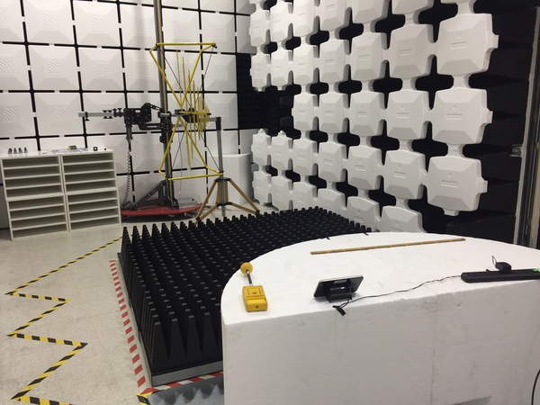 Radiated RF Immunity, <1GHz|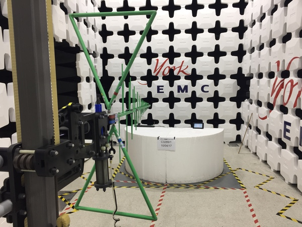Radiated Emissions, <1GHz|  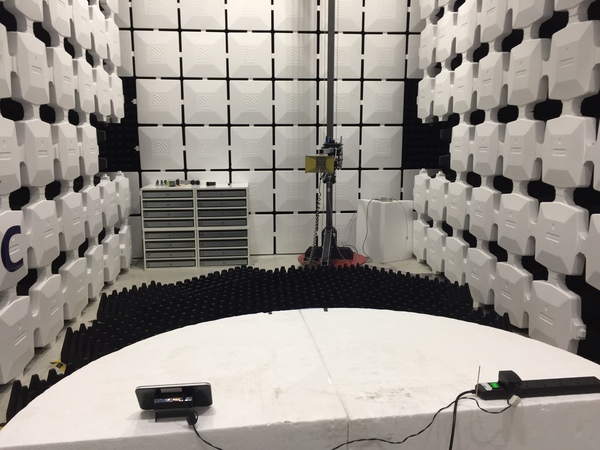Radiated Emissions, >1GHz
| :-------------|:-------------|:-------------|
|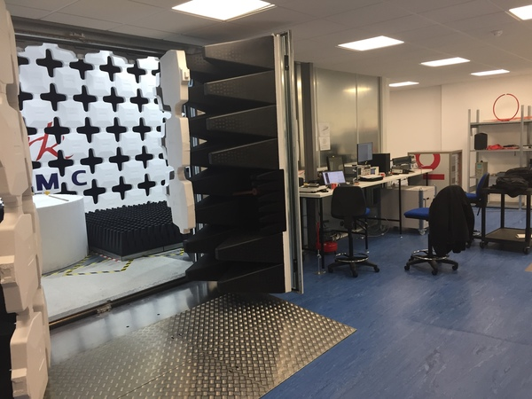 Semi Anechoic Chamber|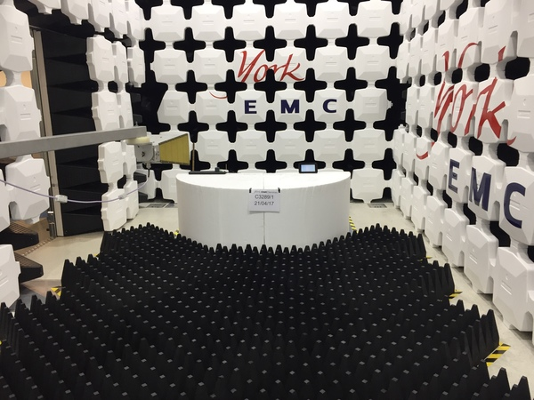Radiated Emissions, >1GHz|  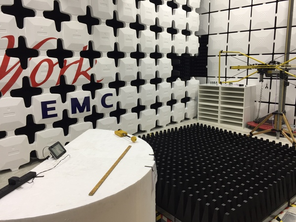 Radiated RF Immunity, <1GHz
|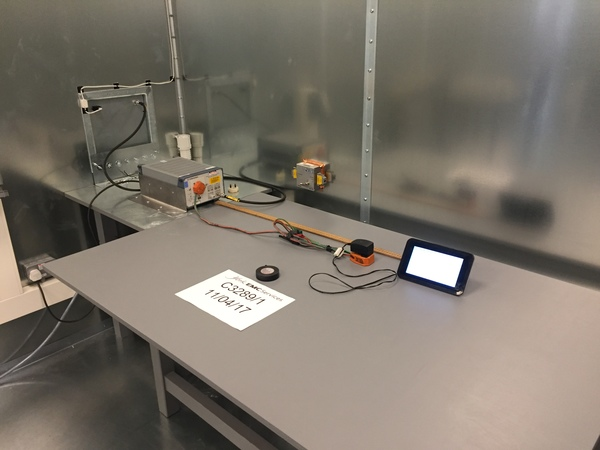 Conducted Emmisions Test|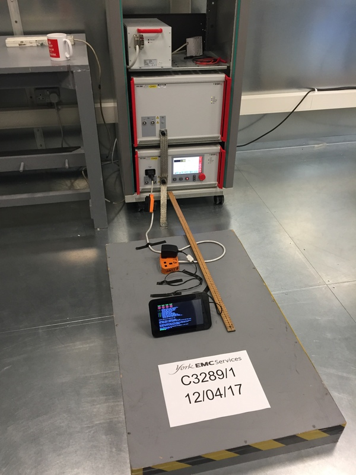EFT/B, Power lines|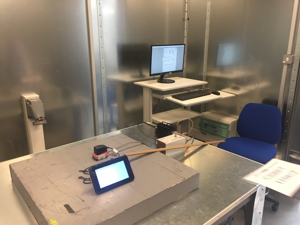Conducted RF Immunity, Power Lines|
|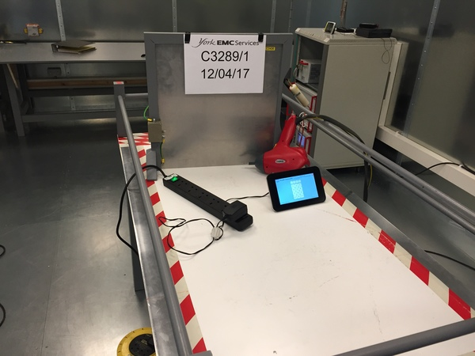ESD Test|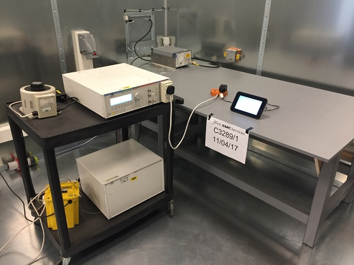Voltage dips and interruptions immunity setup|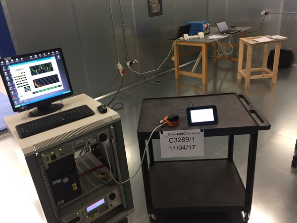Mains Harmonic Emmisions And Voltage Fluctuations Test|
|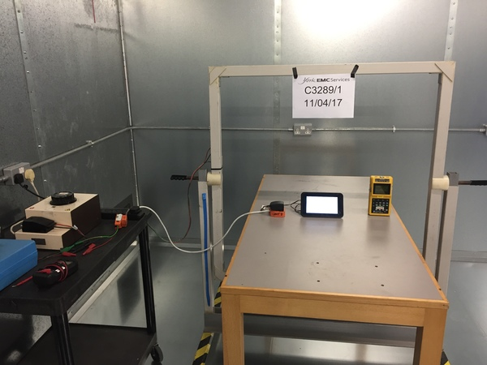Power Frequency Magnetic Immunity||||

**EN60601-1-2:2007 + Corr.20**  
** Medical electrical equipment - Part 1: general requirements for safety. Section 1.2 Collateral Standard: Electromagnetic Compatibility – Requirements and tests.**

As tested by York EMC Services on 7th-21st April 2017

Test Reports and Certificates:

[Electromagnetic Conformance (EMC) Test Report](https://github.com/rprobinson/MediPi/tree/master/EMCTesting/12387TR1-EMC_Test_Report.pdf)

[Electromagnetic Conformance (EMC) Test Cerificate](https://github.com/rprobinson/MediPi/tree/master/EMCTesting/12388TC1-EMC_Test_Certificate.pdf)

This guide instructs how to construct a Raspberry Pi Device which will conform to the following specifications:

#### Component list
* RPI3-MODB-16GB-NOOBS  Raspberry Pi 3 Model B & 16GB MicroSD card preloaded with NOOBS for the Raspberry Pi
* RASPBERRYPI-DISPLAY  Raspberry Pi 7" Touch Screen Display with 10 Finger Capacitive Touch
* STONTRONICS  T6090DV  Power Supply, Raspberry Pi 3 Model B, UK Euro, 5V, 2.5A
* MULTICOMP  CBRPP-TS-BLK/WHT  Dev Board Enclosure, Raspberry Pi 7" Touch Screen with Pi B+ or Pi 2 Boards, Polystyrene
* Wurth Elektronik Conductive Copper Tape, 20mm x 33m - ~1metre required
* Wurth Elektronik Ferrite Ring EMI Suppression Axial Ferrite Bead X2
* Wurth Elektronik Openable Ferrite Sleeve, 35.1 x 21.7 x 18.2mm, For General Application, Safety Relevant Application
* Wurth Elektronik 4 W 620 Ferrite Sleeve, 16 wires maximum, Inner dimensions:23 x 1.5mm
* Advance Tapes AT7 Black PVC Electrical Insulation Tape, 19mm x 33m, 0.15mm Thick ~50cm required
* 10cm Dupont Jumper Wire GPIO Cable  Female-Female x2

| MediPi&nbsp;Patient&nbsp;Device&nbsp;Image&nbsp;&nbsp;&nbsp;&nbsp;&nbsp;&nbsp;&nbsp;&nbsp;&nbsp;&nbsp;&nbsp;&nbsp;&nbsp; | Instructions  |
| ---------------------------------|:-------------:|
| 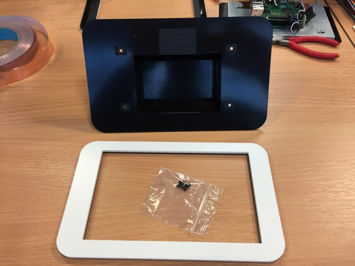 | Unwrap the enclosure |
|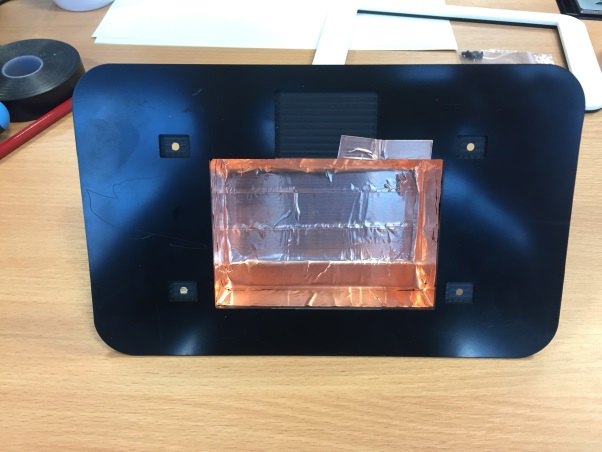 | Stick the copper tape (cut into appropriately sized strips) on the inside of the boxed part of the enclosure. Place the strips side-by-side so that they touch and leave no gaps. Make sure the copper tape is pressed stuck on all sides and is firmly anchored in the corners. All the cut outs for the ports should be covered. Lastly add one small strip which covers the inside corner where there is a rebate for the LCD screen cable – this will make electrical contact with the copper tape and ground plane of the LCD screen.|
||Take the LCD Touchscreen and make sure that the standoff posts are firmly tightened (they often are loose from the package). Firmly lock the inter-board ribbon cable into the lower board (ribbon contacts facing upwards). Slip the ribbon cable ferrite over the cable.|
|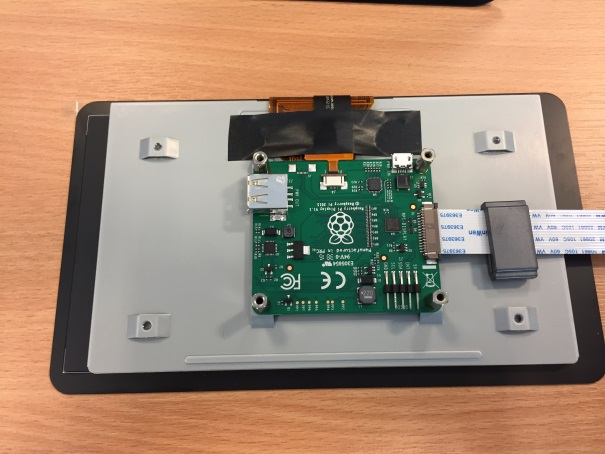|Anchor the main LCD ribbon cable to the steel ground plane using black electrical tape. Make sure that it is not imparting any stress on these cables.|
|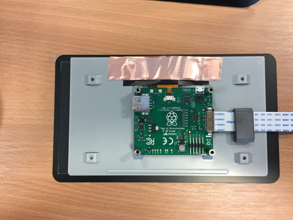|Stick a piece of copper tape over the black electrical tape so that it makes contact with the ground plane. The upper edge of this tape should be level with the top edge of the grey steel ground plane|
|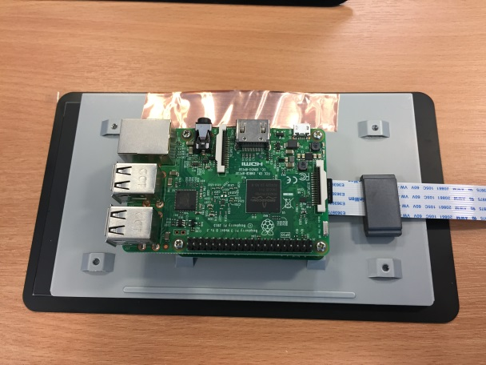|Place the microSD card in the Raspberry Pi board and secure this to the LCD board stand-off posts using the provided screws. |
|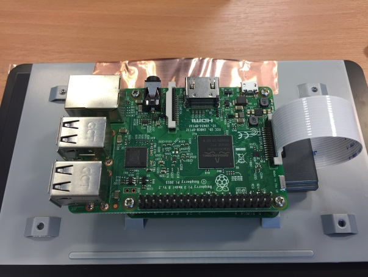|Secure the remaining end of the inter-board ribbon cable into the Raspberry Pi|
|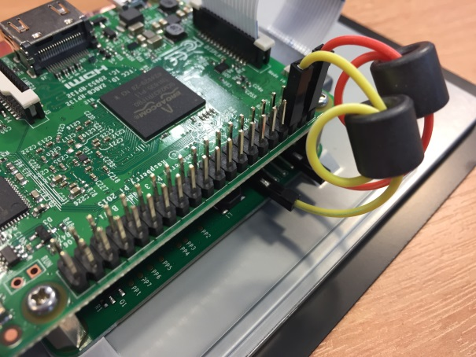|Pass each 10cm jumper wire through the axial ferrites twice and connect: GND on the LCD board to pin 6 on Raspberry Pi GPIO. 5V on the LCD board to pin 2 on Raspberry Pi GPIO|
|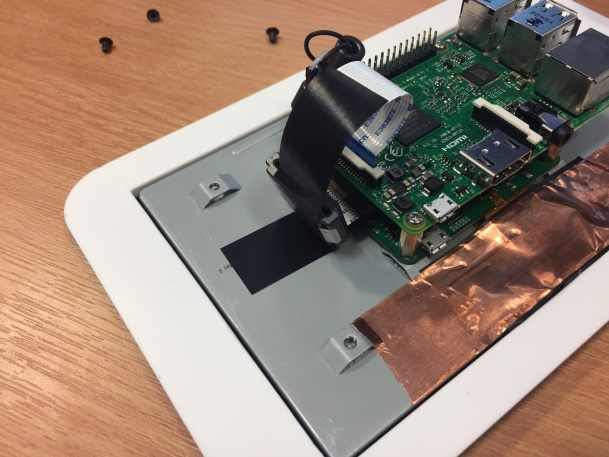|Anchor the ribbon cable ferrite at the bottom end using black electrical tape on both sides of the cable. This stops the ferrite from pulling the ribbon cable from the top of the raspberry Pi board in transit.|
|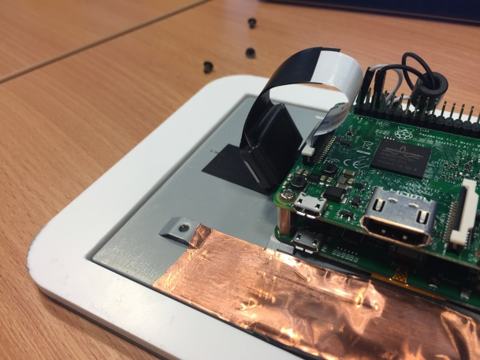|Carefully cut out the copper tape which is covering the power cable cut out in the enclosure back|
|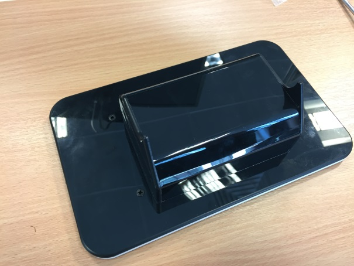|Carefully place the enclosure back over the raspberry Pi board|
||Use black electrical tape to cover over the copper tape covered holes for aesthetic appearance|
|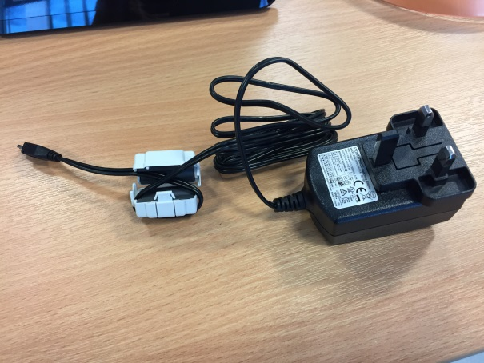|Wrap the power cable twice round the openable ferrite sleeve about 10 cm from the micro USB terminal end and snap lock closed|
